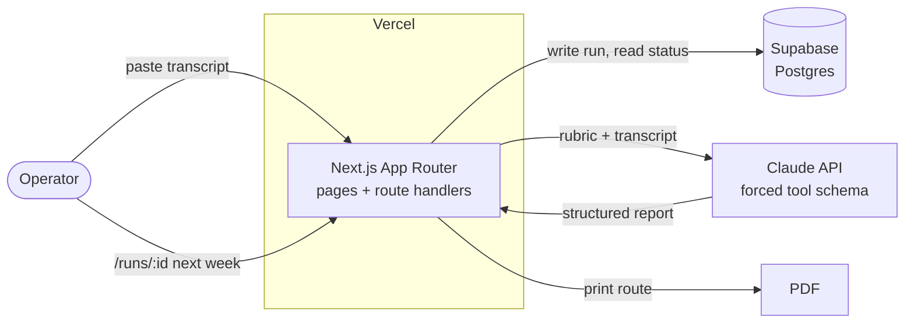
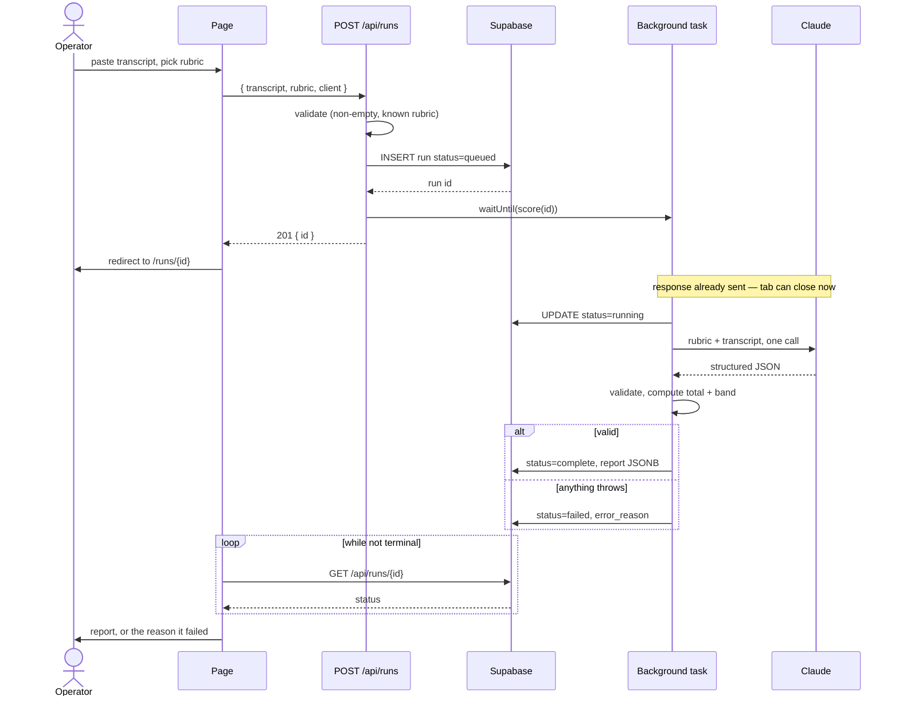
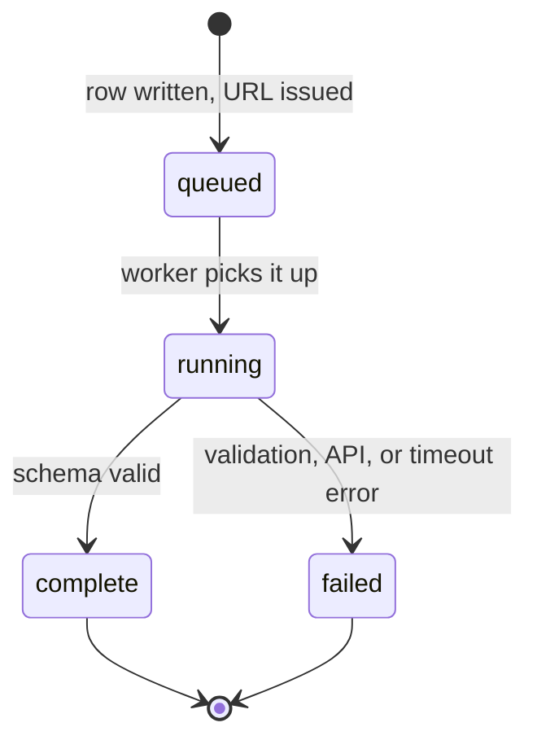
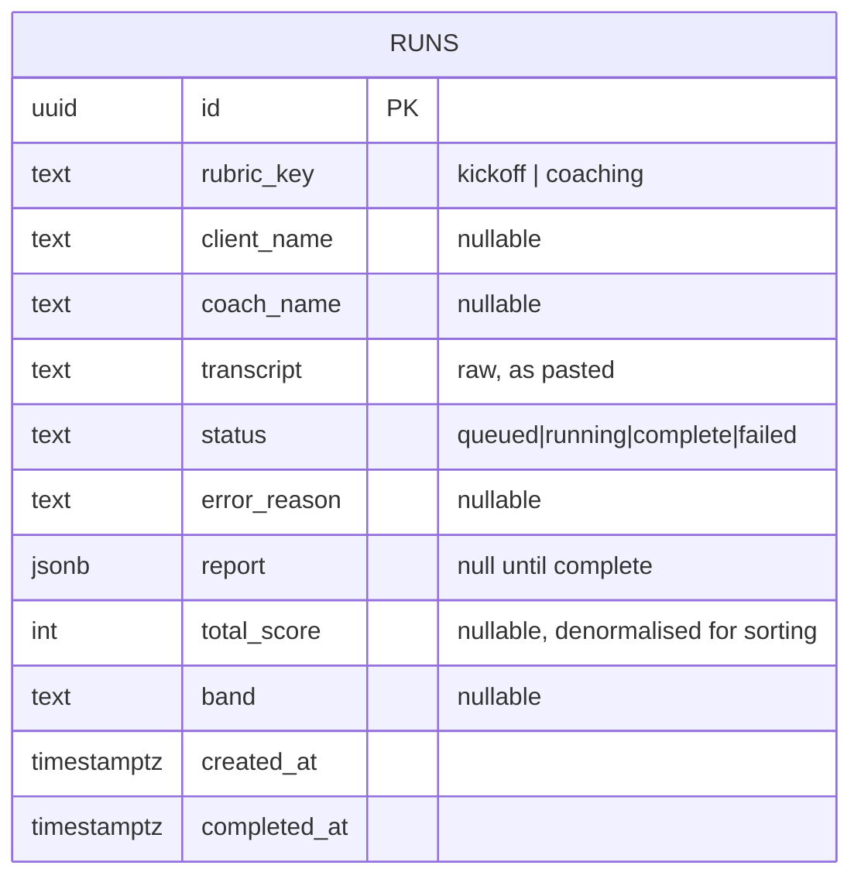
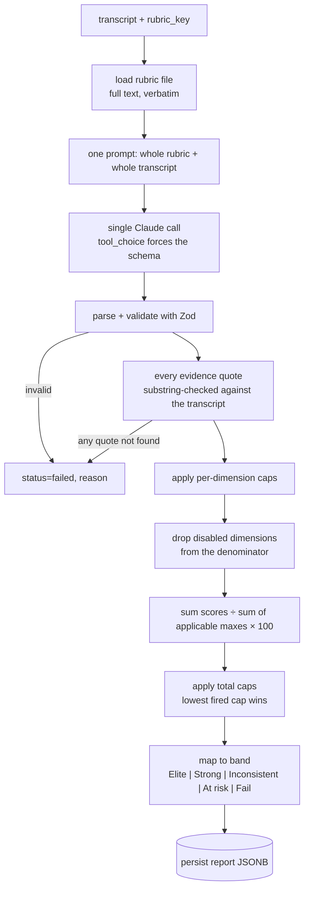

# QC Evaluator — Architecture

> An operator pastes a call transcript, picks the rubric, and gets back a scored report at a
> permanent URL, downloadable as a PDF. Written before any code, so the shape is arguable on
> paper rather than discovered halfway through the build.

---

## 1. System map

Four moving parts. Nothing else.

Rubrics are **static files in the repo**, not database rows. They are fixed input the client
authored, they version with the code, and putting them in a table would buy a CMS nobody asked for.

---

## 2. Request lifecycle

The important diagram. Everything the brief demands about durability lives here.

**Why the write comes before the work.** The run row exists before Claude is ever called, so the
URL is valid the instant it is handed out. A crash mid-scoring leaves a `failed` row with a reason,
never a dead link.

**Why `waitUntil` and not a queue.** `waitUntil` from `@vercel/functions` keeps the function alive
after the response is flushed. A single scoring call is one LLM round trip, well inside the limit.
A real queue (Inngest, QStash, pg cron) is the correct answer at volume or with retries. It is not
the correct answer for one operator pasting one transcript, and it costs an hour of the four.

**Measured, not assumed.** Two real runs against the supplied transcripts:

| Transcript | Characters | Input tokens | Output tokens | Wall clock |
|---|---|---|---|---|
| `kickoff-02.txt` | 15,749 | 6,161 | 13,890 | **181.7s** |
| `coaching-02.txt` | 64,795 | 22,810 | 9,872 | **130.9s** |

The longer transcript was faster. Latency here tracks output tokens, which means the report plus
the model's own reasoning, not the length of the input. A four-fold increase in transcript size
cost nothing. That is worth knowing, because it kills the intuition that the 65,000 character
transcript is the hard case: it is not, and no chunking strategy would have helped anything.

What it does mean is that a run takes **two to three minutes**, which is far past a default
serverless function limit. `maxDuration` has to be raised explicitly, and the stale-run guard
below stops the run from hanging forever if it is still not enough.

---

## 3. Run state machine

`failed` is a first-class state with a human-readable reason on the row. "A failed run says why"
is in the brief, so silence is a bug.

**The hole in this, and the guard for it.** If the background task exceeds the function's
`maxDuration`, Vercel kills it mid-flight. The `catch` never runs, nothing writes `failed`, and the
row sits at `running` forever while the operator watches a spinner that will never resolve. That is
exactly the failure the brief says must not happen, arriving through the back door.

So `maxDuration` is set explicitly on the route rather than left to the platform default, and the
status endpoint treats a `running` row older than that limit as failed with the reason "scoring
timed out". About six lines, no cron, no queue. A real deployment would reap these rows on a
schedule instead of deciding at read time, and I would say so.

---

## 4. Data model

One table.

**Why the whole report is one JSONB column.** The report is an immutable artifact of one scoring
run against one rubric version. It is written once and read whole. Splitting twelve dimensions into
a child table buys joins and migrations and answers no question the brief asks.

**When that stops being right:** the moment anyone wants "average score on dimension 3 across all
coaches this quarter." That is a `dimension_scores` table and it is a twenty-minute migration. The
brief describes a report, not a dashboard, so it is not built.

`total_score` and `band` are duplicated out of the JSONB purely so a future list view can sort
without unpacking JSON.

---

## 5. Scoring pipeline

### The total is not a sum

This is the correction that reading the real rubrics forced. Four mechanics sit between the
twelve dimension scores and the number on the report, and none of them were in the first draft
of this document.

**1. Global automatic score caps.** Both rubrics open with a cap table checked *before* scoring.
Some cap a dimension, some cap the whole call.

| Rubric | Condition | Cap |
|---|---|---|
| Kick-off | No follow-up questions anywhere in the call | max 70 total |
| Kick-off | Coach speaks >70% without client engagement | max 80 total |
| Kick-off | Client shows unresolved confusion at any point | max 75 total |
| Kick-off | No North Star statement constructed | max 10/15 on D4 |
| Coaching | Coach speaks >75% of the call | max 75 total |
| Coaching | No action steps stated for either party before close | max 70 total |
| Coaching | Next call not booked live | 0/5 on D10, non-recoverable |
| Coaching | No connection to long-term vision | max 10/15 on D3 |
| Coaching | No concrete accountability commitment the client owns | max 10/15 on D6 |

Dimension caps clamp the dimension before summing. Total caps clamp the percentage after.
When more than one total cap fires, the lowest wins. **Every fired cap is named in the report**,
because a coach told they scored 70 deserves to know it was a ceiling and not a tally.

**1b. Structured output has a size limit, so validation happens in two places.**

The first version of the schema gave each of the twelve dimensions its own list of permitted
scores, making an out-of-band score literally unrepresentable. The API rejected it: *"The
compiled grammar is too large."* Structured output is enforced by compiling the schema into a
decoding grammar, and twelve distinct unions inside twelve distinct object shapes exceeds what
that will accept.

So there are two gates instead of one. The schema blocks any score that appears **nowhere** in
the rubric, which keeps the grammar small. `verify.ts` blocks any score that is legal somewhere
in the rubric but illegal for **that** dimension, and fails the run with a message naming the
dimension. A 10 on a dimension worth 5 is caught, just a second later than before.

**2. Discrete buckets, no interpolation.** The coaching rubric says it outright: each dimension's
score must be exactly one of the values listed in its own table. D4 allows 15, 10, 5 or 0 and
nothing between. So the Zod schema is a per-dimension enum built from the rubric file, not an
integer range. A model handing back 12.5 fails the run.

**3. TWO coaching dimensions are conditional, and they are described differently.**

This one was found by running the system, not by reading the rubric. On `coaching-02.txt` the
model marked D2 N/A, `verify.ts` was ready to fail the run for it, and the rubric turned out to
be on the model's side. Buried at the end of D2, not in the preamble where D4's rule sits:

> *"If diagnostics not applicable this cycle (non-milestone call, no video submitted), note this
> and score N/A — redistribute weight to D3 and D4. Do not penalize the coach."*

Diagnostics only happen at weeks 8, 16 and 24, so most coaching calls have none to review. The
first version of the spec missed it, and a test asserting "exactly one dimension is optional"
locked the mistake in. Both are corrected.

**How each is handled:** the dimension leaves *both* sides of the fraction. Removing it from the
denominator **is** redistribution — every surviving dimension becomes worth proportionally more
of the total, and the coach is not punished for a dimension the call was never meant to contain.

That deviates from the letter of D2's note, which sends the weight to D3 and D4 specifically.
Deliberately: the note gives no proportions, and sending weight to D4 breaks on a call where D4
is itself disabled, which is exactly what `coaching-02.txt` is. Proportional across all survivors
is the only reading that holds in every combination. **Second question I would have asked.**

**3b. D4 specifically, and the mechanics the rubric prescribes.** Movement Coaching Quality switches
off when all four detection criteria are absent: no live movement, no setup/breathing/control
cues, no video review with real-time feedback, no real-time form correction. If even one is
present it scores normally. The rubric names the fields it wants back: `disabled`,
`disabled_reason`, `score: null`, `band: "N/A"`. The schema uses those names rather than
inventing parallel ones.

**4. The denominator is derived, not hardcoded.** Kick-off's twelve maximums sum to exactly 100.
Coaching's sum to **105**, while the rubric prose says 100 with D4 active and 85 without. Both
numbers are 5 apart from the arithmetic, so the coaching rubric contradicts itself.

**Decision: sum the applicable maximums from the rubric file and normalise against that.** So
coaching scores out of 105, or out of 90 when D4 is disabled, and the result is expressed as a
percentage on the 100 scale the bands are written against. Kick-off is unaffected because it
already sums to 100.

The alternative was trusting the prose (100 / 85), which makes a perfect coaching call score
105 out of 100. Deriving the denominator from the data is internally consistent whichever
number the client meant, and it is the honest move given the source is ambiguous. The report
shows the raw sum and the denominator used, so the discrepancy is visible rather than papered
over. **This is the first question I would have asked the client.**

### The 65,000 character question

65,000 characters is roughly **16,000 tokens**. Claude's context window is 200,000. It fits with
more than 90% of the window unused.

**Decision: one call, whole transcript, no chunking.** Chunking a transcript is actively harmful
here, because a rubric dimension like "did the coach connect the block to the long-term vision"
depends on evidence that can appear anywhere in the call. Split it and every chunk scores the same
dimension blind to the others, and the merge step has to guess.

The threshold where this changes is somewhere near 400,000 characters, at which point the move is
still not RAG. It is dropping to a cheaper model for a first pass, or splitting by rubric dimension
rather than by transcript position, so each call still sees the whole call.

### Refusing to guess

"One of the four transcripts exists to catch a system that guesses." So this is a schema
constraint, not a polite request in the prompt:

- Every dimension **must** return an `evidence` array of verbatim transcript quotes.
- A post-validation pass rejects any evidence quote that is not a substring of the submitted
  transcript. A fabricated quote fails the run rather than reaching the coach.
- A dimension that scores above its lowest bucket with an empty `evidence` array fails the run.
  Credit has to be paid for in quotes.

That substring check is cheap and it is the difference between a system that claims not to
hallucinate and one that cannot.

**What it actually caught, and what that changed.** On the third real run it rejected this:

> transcript: `...rather than sitting back` **`and waiting`**`. So I'm going to check in proactively...`
> model:      `...rather than sitting back. So I'm going to check in proactively...`

Two words dropped from the middle of a sentence, presented as a verbatim quote. Not an
invention. A tidy-up. And a coach who searched the transcript for that sentence would not have
found it, which makes it exactly as damaging as an invention and completely invisible to
inspection.

The interesting part is what to do about it, because a strict check that fails one run in three
is not a product. Two options: loosen the check, or fix the cause.

**The check stays.** The failure was elision, and the prompt already had an unused answer to it:
`evidence` is an ARRAY. There is never a reason to bridge over words you do not want, because
two exact quotes can go in as two entries. The prompt now says so explicitly, tells the model
that shortening is the most common way to fail rather than inventing, and asks for shorter
quotes. The same transcript then scored 97/100 with every quote verified.

Loosening the matcher would have made the failure invisible instead of absent. Naming the exact
behaviour in the prompt made it stop happening. Worth saying in the video, because the
temptation to soften a check that just failed is the whole trap.

**What an absent behaviour scores, corrected.** The first draft of this document said an
unevidenced dimension scores 0 and is labelled `not_evidenced`. The rubrics say otherwise, in
both files. Kick-off principle 4: if a behaviour cannot be verified, score the lower tier of the
band the call is in, and "this is NOT a license to drop into a lower band entirely." Coaching
principle 3 says the same thing more briefly.

So the bolt-on rule is deleted. Scoring follows the rubric's own buckets, and absence lands
where the rubric puts it, which for most dimensions is the Fail bucket anyway because their
0-row already reads as "the coach did not do this." Overriding that with a blanket zero would
have scored several dimensions below what the client's own rubric asks for.

`not_evidenced` survives as a **label on the rationale**, not as a score. It tells the coach the
score rests on absence rather than on a judgement call, which is information they need and which
costs nothing to carry.

Three states, and they are different things:

| State | Means | Denominator |
|---|---|---|
| scored | evidence found, bucket chosen | counted |
| not_evidenced | behaviour absent or unverifiable, scored by the rubric's own conservative rule | counted |
| not_applicable | coaching D4 only, all four detection criteria absent | **excluded** |

Collapsing `not_applicable` into `not_evidenced` would punish a strategy-only coaching call for
containing no movement work, which is not a fault the rubric is measuring.

### The rubric text goes in whole

The rubric files are not data to be parsed into a compact schema and summarised. They carry
calibration anchors drawn from real reviewer corrections ("coach references the client's goals
without saying 'I read your notes' → Strong, not Mid"), per-dimension positive and negative
signals, and quoted training notes from the client's own reviewer. That material is what keeps
scoring aligned to the human standard, and paraphrasing it away is how the scores drift.

So the whole rubric file goes into the prompt verbatim. At ~30k characters against a 200k window,
with the transcript alongside, there is room and no reason to be clever.

---

## 6. Report shape

Mirrors the client's existing report exactly. Order matters, it is the order the coach reads in.

| Block | Content |
|---|---|
| Header | client name, coach name, rubric type, assessed date, **Download PDF** |
| Score | total and the band, by the rubric's own band names |
| Caps fired | any global cap that clamped the score, named, or nothing if none fired |
| The one thing | the single highest-leverage change, and what the call would have scored with it |
| The brief | a few sentences to the coach on how the call went |
| Red flags | what puts this client at risk of leaving, and why |
| Dimensions ×12 | collapsed: name, score/max, per-dimension band. Expanded: reasoning, evidence quotes, quick fix |

Each dimension carries its own maximum and its own band label (Elite / Strong / Mid / Fail),
which the rubrics define per dimension and which is separate from the call's overall band.
The maximums are not twelve equal buckets. Kick-off sums to 100; coaching sums to 105, or 90
with D4 disabled, and is normalised to the 100 scale.

**Caps fired is a required block, not decoration.** A capped 70 and an earned 70 are different
calls and the coach cannot act on the first without being told a ceiling applied.

### PDF

The exercise video frames the PDF as a bonus that earns points for taste rather than a pass/fail
requirement. It is built anyway, because it is cheap here and taste is being scored.

**Decision: a `/runs/[id]/print` route with print CSS, triggered by the download button.**

The same React components render both the screen report and the PDF, so the two can never drift.
Zero new dependencies and nothing to break on Vercel.

Rejected: Puppeteer needs a bundled Chromium and fights Vercel's function size limit.
`@react-pdf/renderer` means maintaining a second, separate rendering of the same report, which is
exactly how a PDF ends up out of date with the page it claims to mirror.

The cost is honest: the operator sees a browser print dialog rather than an instant file download.

---

## 7. Routes

| Route | Does |
|---|---|
| `/` | paste transcript, pick rubric, submit |
| `POST /api/runs` | validate, insert, hand off scoring, return id |
| `GET /api/runs/[id]` | status poll while queued or running |
| `/runs/[id]` | the report, or progress, or the failure reason |
| `/runs/[id]/print` | print-styled report the PDF button targets |

Five routes. Anything past this is scope nobody asked for.

---

## 8. Open decisions

Questions I would have asked the client, with the assumption made instead. These go in the Loom.

| Question | Assumption made |
|---|---|
| **The coaching rubric's twelve maximums sum to 105, but the prose says the total is 100 with D4 active and 85 without. Which is right?** | **Neither is assumed.** The denominator is summed from the rubric file itself, so coaching scores out of 105 (or 90 with D4 off) and is normalised onto the 100 scale the bands use. Internally consistent whichever number was intended, and the report shows the raw sum and the denominator so nothing is hidden. |
| Does an unevidenced dimension score 0? | **No, corrected.** Both rubrics say score the lower tier of the band, explicitly not a drop to the floor. Scoring follows the rubric's buckets; `not_evidenced` is a label on the rationale, not a score override. |
| When two total caps fire at once, which applies? | The lowest. Caps are ceilings and the tightest ceiling is the real one. |
| Do total caps apply before or after normalising to 100? | After. The caps are written as "max 75 total" against the 100 scale the bands use. |
| Who decides coaching D4 is disabled, the model or the operator? | **The model**, because the rubric spells out four detection criteria and requires a written `disabled_reason`. Asking the operator adds a UI control the brief never asked for, and the reason string is auditable either way. |
| Which model scores? | **Opus 5, switchable by `SCORING_MODEL`.** The exercise is judged on fidelity to rubrics full of nuanced calibration anchors, latency is invisible behind `waitUntil`, and the volume is a handful of runs. Dropping to Sonnet is a one-line change if the function limit bites. |
| Are band thresholds inclusive at the boundary? | Inclusive lower bound, so exactly 70 lands in the band starting at 70. |
| Should a run be re-scorable? | No. A run is an immutable record. Re-scoring means a new run and a new URL. |
| Is the transcript sensitive enough to need auth? | No auth. The brief describes an internal operator tool and the URL is an unguessable UUID. Real deployment needs auth on day one and I would say so. |
| Client and coach name: parsed from the transcript or entered? | Optional operator input. Parsing names out of a transcript is guessing, and this system does not guess. |

---

## 9. What is deliberately not built

Auth. A run history list. Coach comparison. Rubric editing. Retries. Streaming progress.
Multi-tenant anything. Sales and strategic-review call types.

**The "your feedback" panel.** It is visible in the app Luke and Ruben demo in the exercise video,
and they say out loud that candidates should not build it. Named here so it is clear it was seen
and skipped, not missed.

The brief names the whole surface: kick-off and coaching calls scored from a pasted transcript.
